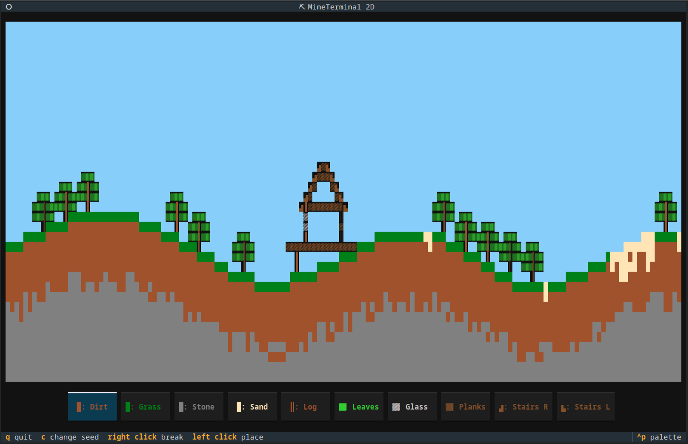

# MineTerminal 2D

This Python program using Textual allows you to play around in a canvas resembling a 2D sandbox game world.

Features:

- random world generation with a seed
- saving/loading
- 10 different blocks

Controls are described on the game welcome screen - it's basically just using the arrow keys and left/right click.

The welcome screen can be skipped by starting the TUI with `python main.py skip`.
